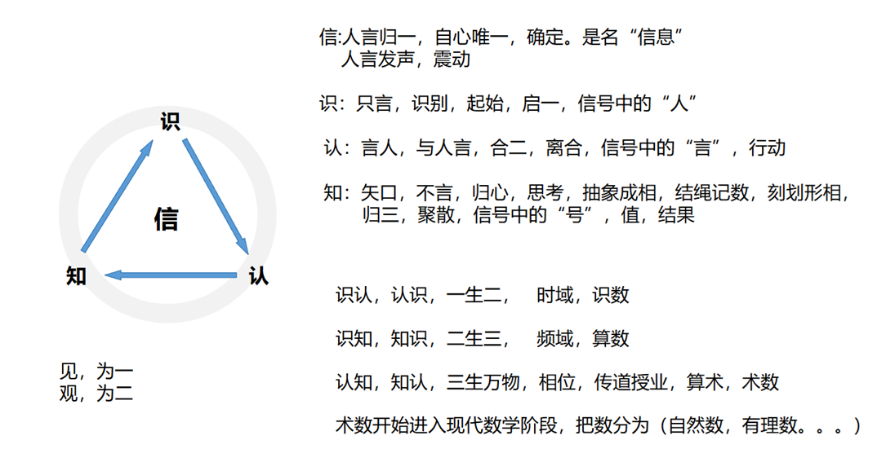
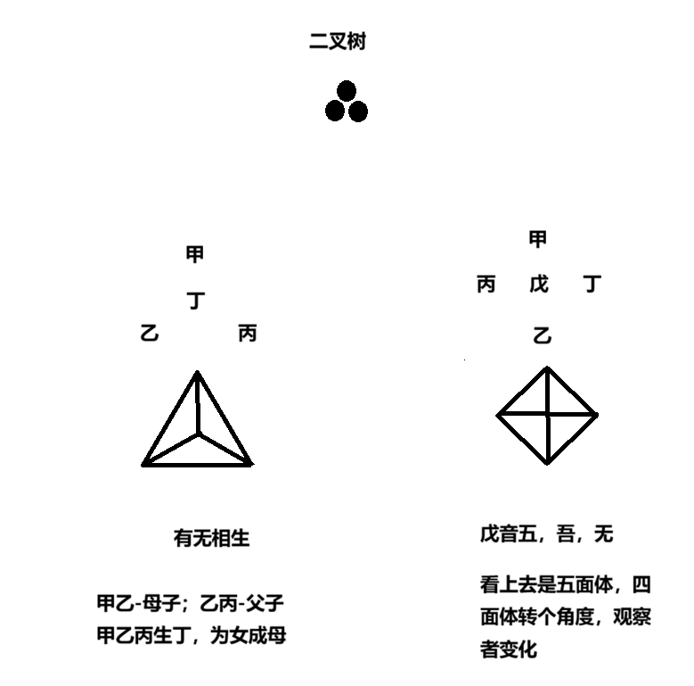

═══════════════════════════════════════════
▌  线 上：编译真理（当前状态）
═══════════════════════════════════════════

## 定义

整个认知框架由**两核**构成，各从一张源图生长而出：**阴核**＝认知本身＝[[concepts/认知架构-v2-阴阳框架]]（过程之图：信→识→认→知闭环），本质是**信息**；**阳核**＝认知对象＝[[concepts/点线面体生成序列-观察者与主客]]（结构之图：点线面体计数+观察者），是天干地支的起源，本质是**能量，能够测量**。两核以双锚点对接（信↔丁、息↔戊），经"见一观二"枢机展开，共同收敛到**道生一、一生二、二生三、三生万物**。

## 第一性原理 (The Signal)

阴核=信息（信↔丁），阳核=能量可测（息自心↔戊）；见为一，观为二。

## 核心论点

### 1. 两核的分工与阴阳归属

| | 阴核 | 阳核 |
|:--|:-----|:-----|
| 卡片 | 认知架构-v2-阴阳框架 | 点线面体生成序列-观察者与主客 |
| 源图 | 信识认知四字循环图（07-04 用户提出） | 二叉树生成与观察者图（08-05 七轮一轮输入） |
| 性质 | **过程**：认知本身的运转 | **结构**：认知对象的几何 |
| 读法 | 时域→频域→相位（信号变换） | 点→线→面→体（计数生成） |
| 本质 | **信息** | **能量**（可测量：计数/群阶/4×3=12） |
| 种子 | 信（人言归一，自心唯一） | 丁（女成母之信种） |

> 阴阳归属是关系性的：在认知/对象这一对中，认知（信/信号/不变量）为阴，对象（相/采样/万物）为阳。

### 2. 收敛锚点：信 ↔ 丁，息（自心）↔ 戊（用户修正版）

两核不是共享同一个字，而是**双锚点对接**：

- **信 ↔ 丁**：阴核之信＝人言归一，是名"信息"；阳核之丁＝女＝被生成的**信种**（三生→有幸→通性→心生→通→信）。信息一脉相承，故本卡（阴核）是**信息**之卡
- **息（自心）↔ 戊**：息＝自＋心＝呼吸；阴核术层五步=加+减的**呼吸**（损之又损）；阳核之戊＝吾＝无＝观察者。自心之息 ↔ 观察者之戊
- 阳核（天干地支的起源）是**能量**之卡：能量能够测量——计数、对称群阶（6/24/12/48）、4×3=12 皆可验

与库内旧构互锁：v2「物 = 信息 × 能量」（信息代表有无，能量代表高下长短）；五套同构「灭=一在火上=能量→信息」——两核正是"物"的信息/能量两半。

**信（丁）作为信息种子是阴，息（戊）作为可测的观察者/能量是阳**——两核不是两个体系，是同一个"一"的信息/能量两面。

### 3. 枢机："见为一，观为二"

- **见＝一**：信的状态，不取不舍，只是确定（v2 术层"已经是信"）
- **观＝二**：观的动作一发生，主客即分——戊/己＝我/你，4×3=12 定向观，天圆地方＝观察定理，全部是"观"的展开

### 4. 统一生成律表

| 生成律 | 阴核（过程/认知本身） | 阳核（结构/认知对象） |
|:--|:-----|:-----|
| 道＝0 | 不可说（道=0/言道=1） | 未观察前的无相 |
| 道生一 | 信：人言归一，启一 | 二叉树根；戊=观者入座 |
| 一生二 | 识认：合二，离合，**时域**（识数） | 一生二两分支；观为二，主客分 |
| 二生三 | 识知：归三，抽象成相，**频域**（算数） | 三角形甲乙丙；有无相生；天地人 |
| 三生万物 | 认知：相位，术数（→现代数学） | 甲乙丙生丁，**女成母**＝递归引擎 |
| 万物归 | 归＝回到无（5 步之⑤） | 5 回卷到 0/1（首尾同一） |

闭环即降熵：万物经"归"回到信。

### 5. 时域/频域/相位的双重读法

- 阴核是**信号的变换过程**：识认=时域采样（一生二）、识知=频域变换（二生三）、认知=相位显相（三生万物）
- 阳核是**变换结果的几何显相**
- 与 [[concepts/五套五阶段同构]]「64卦=傅里叶同构」互锁：界是变换，境是频谱——"认知为界，知识为境"的信号学读法

## 当前共识

- 两核结构（阴=认知过程/阳=对象结构）入库（用户裁决）
- 双锚点（信↔丁=信息；息自心↔戊=能量可测）、见一观二枢机、统一生成律表入库（用户修正版）
- 源图两张存 raw/assets/

## 开放问题

- **戊侧归属张力**：阳核卡旧读法"音无（戊），信息"把戊归信息，本次修正把戊归能量/观察者——戊究竟居信息侧还是能量侧？（待用户裁决）
- **见与观的归属**：见/观是同一观察者的两种状态（梦/醒），还是两个操作者（人/AI）？——决定"观"在本卡中的主体归属（悬置中）
- 时域/频域/相位能否与认知五阶×数学史（识数→计数→算数→术数→现代数学）完全对表？
- 元卡与 [[concepts/关系先于对象-天地人坐标]]（体系第一公理）的层级关系：公理在元卡之内还是之上？

═══════════════════════════════════════════
▌  线 下：时间线（证据日志）
═══════════════════════════════════════════

---

## 辩论与演化记录

### 2026-08-05 — 双核构想的提出与收敛

- **输入**：用户提出"v2-阴阳框架（认知本身/阴）与点线面体生成序列（认知对象/阳）构成两核，皆可收敛到道生一二三"，并附两张最初源图
- **探索结果**：初版信≡戊锚点；"见为一，观为二"为两核铰链；时域/频域/相位与傅里叶同构互锁
- **用户裁决**：新建元卡固化；源图入 raw/assets/；两卡补源图行
- **悬置**：见/观归属之问未答
- **来源**：本对话 + raw/assets/ 两张源图

### 2026-08-05 — 锚点修正（用户纠错）

- **输入**：用户纠正"信≡戊"应为双锚点：信↔丁，息（自心）↔戊；本卡=信息，另一卡=天干地支起源=能量，能够测量
- **结果**：论点 2 重写为双锚点版；两核本质定为信息/能量；与 v2"物=信息×能量"、五套同构"灭=能量→信息"互锁
- **注**：阳核卡中"音无（戊），信息"的旧读法与本次修正存在张力（戊侧归属信息还是能量/观察者），记入开放问题

## 缘起溯源

| 节点 | 时间 | 来源 | 做了什么 | 认知状态跃迁 |
|:----|:-----|:-----|:---------|:-------------|
| 阴核萌芽 | 2026-07-04 | MiniMax Mavis + 源图一 | 用户提出信识认知四字图 | 梦 → 觉 |
| 阳核萌芽 | 2026-08-05 | QwenChat + 源图二 | 二叉树生成图输入 | 梦 → 觉 |
| 双核提出 | 2026-08-05 | 本对话 | 用户指出两核构成完整框架 | 觉 → 醒 |
| 收敛 | 2026-08-05 | 本对话 | 信≡戊锚点、见一观二枢机、统一生成律表 | 醒 → 悟 |
| 🆕 锚点修正 | 2026-08-05 | 本对话 | 用户纠错：信↔丁（信息）、息自心↔戊（能量可测）；两核=信息/能量 | 悟（去相） |

## 交叉引用

- [[concepts/认知架构-v2-阴阳框架]] — 阴核（认知本身）
- [[concepts/点线面体生成序列-观察者与主客]] — 阳核（认知对象）
- [[concepts/信识认知框架]] — 信＝阴核种子（锚点：信↔丁）
- [[concepts/五套五阶段同构]] — 64卦=傅里叶同构，时域/频域互锁
- [[concepts/降熵-收敛与确定性]] — 万物归＝闭环＝降熵
- [[concepts/关系先于对象-天地人坐标]] — 二生三＝关系确立（公理层级待定位）
- [[concepts/梦觉醒悟道-认知状态流转]] — 见/观归属悬置问的参照

## 原始对话

> 源图： ｜ 
